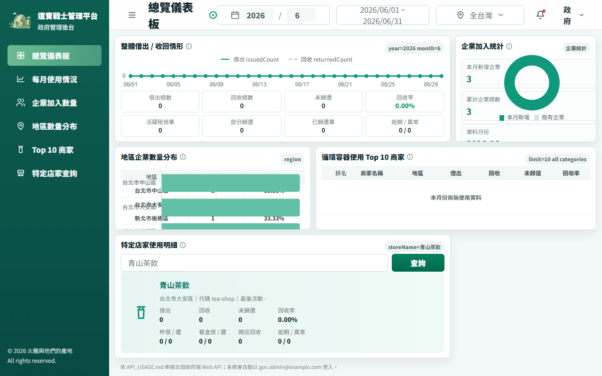

# Markerthon Reusable Container System


## Overview

Markerthon is a local demonstration system for reusable container borrowing, return scanning, and recovery reporting. It models a circular workflow where merchants issue reusable cups or meal boxes, customers return them by QR scan, and a government-facing dashboard monitors usage and recovery metrics.

The repository is intended to run entirely on a developer machine. The backend uses SQLite, the two frontends use Vite, and the launcher in `run.py` can start all three services together.

## Screenshot



## Applications

- Backend API in `backend/`: FastAPI, SQLite models, Alembic migrations, seed data, daily CSV report generation, and tests.
- Merchant web app in `webapp/`: React UI for merchant login, QR creation, return scanning, registration, and merchant statistics.
- Government dashboard in `web/`: TypeScript Vite UI for monthly usage, enterprise counts, regional distribution, top stores, and store detail views.

## Quick Start

Prerequisites:

- Python 3.11 or newer.
- Node.js and npm.
- Backend dependencies from `backend/requirements.txt`.

From this directory, install backend dependencies:

```powershell
cd backend
python -m pip install -r requirements.txt
cd ..
```

Set a local JWT signing secret before starting the backend. The app intentionally fails at startup if `JWT_SECRET` is missing.

```powershell
$env:JWT_SECRET = "replace-with-a-local-random-value"
python run.py --seed
```

The launcher starts:

```text
http://127.0.0.1:8000/docs
http://127.0.0.1:5173
http://127.0.0.1:5174
```

Useful launch modes:

```powershell
python run.py --backend-only --seed
python run.py --webapp-only
python run.py --web-only
python run.py --no-reload --no-seed
```

When frontend dependencies are already installed and startup should not run npm install automatically, use:

```powershell
python run.py --skip-webapp-install --skip-web-install
```

## Demo Credentials

Seeded accounts are for local demonstration only. Merchant and government demo users are defined in `backend/app/seed.py`, and the single demonstration password is centralized there as `DEMO_PASSWORD`.

Common seeded emails:

- Merchant owner: `tea.owner@example.com`
- Merchant staff: `tea.staff@example.com`
- Merchant owner: `bento.owner@example.com`
- Merchant owner: `cafe.owner@example.com`
- Government dashboard: `gov.admin@example.com`

Do not reuse the demo password or the local `JWT_SECRET` value in any hosted environment.

## Tests

Backend tests live in `backend/tests/` and run from `backend/`:

```powershell
cd backend
$env:JWT_SECRET = "replace-with-a-local-test-value"
python -m pip install -r requirements.txt
python -m pytest tests
```

The tests create temporary SQLite databases and report directories, so they do not require a persistent local database.

## Project Structure

```text
backend/                         FastAPI API, SQLite models, migrations, seed data, tests
backend/app/                     Application package
backend/alembic/                 Database migrations
backend/tests/                   Backend pytest suite
webapp/                          Merchant-facing Vite React app
web/                             Government-facing Vite TypeScript dashboard
run.py                           Local multi-service launcher
E2E_TESTING.md                   Local end-to-end testing notes
reusable-container-proposal.md   Product proposal summary
LICENSE                          MIT license
```

API details are documented in `backend/API_USAGE.md`. Frontend-specific setup is documented in `webapp/README.md` and `web/README.md`.

## Publication Notes

- The web build output directory is intentionally not included. Rebuild frontend bundles locally when needed.
- `.gitignore` excludes local environments, logs, databases, and generated dist directories.
- The current working tree requires the owner to set fresh runtime secrets before deployment.
